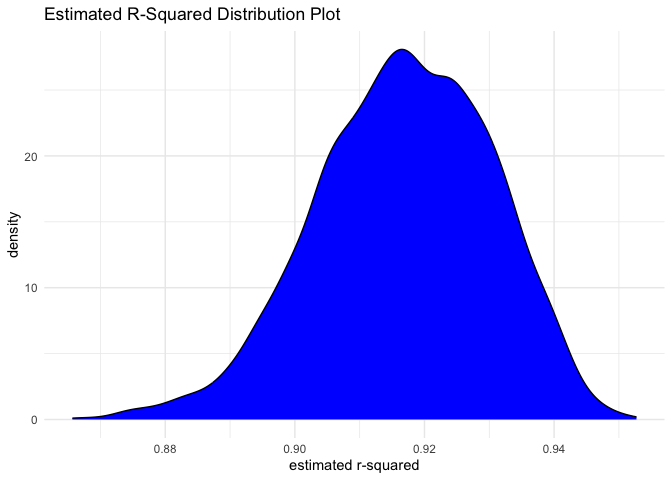
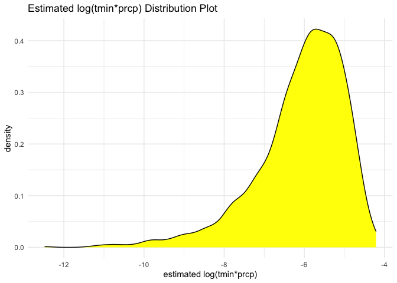
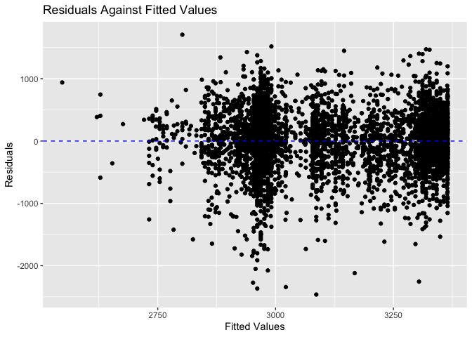
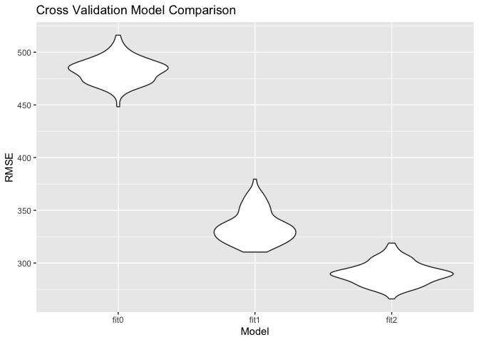

P8105 HW6
================
2023-12-02

# Problem 2

``` r
library(tidyverse)
```

    ## ── Attaching core tidyverse packages ──────────────────────── tidyverse 2.0.0 ──
    ## ✔ dplyr     1.1.3     ✔ readr     2.1.4
    ## ✔ forcats   1.0.0     ✔ stringr   1.5.0
    ## ✔ ggplot2   3.4.3     ✔ tibble    3.2.1
    ## ✔ lubridate 1.9.2     ✔ tidyr     1.3.0
    ## ✔ purrr     1.0.2     
    ## ── Conflicts ────────────────────────────────────────── tidyverse_conflicts() ──
    ## ✖ dplyr::filter() masks stats::filter()
    ## ✖ dplyr::lag()    masks stats::lag()
    ## ℹ Use the conflicted package (<http://conflicted.r-lib.org/>) to force all conflicts to become errors

``` r
library(ggplot2)
set.seed(1)

#download data
weather_df = 
  rnoaa::meteo_pull_monitors(
    c("USW00094728"),
    var = c("PRCP", "TMIN", "TMAX"), 
    date_min = "2022-01-01",
    date_max = "2022-12-31") |>
  mutate(
    name = recode(id, USW00094728 = "CentralPark_NY"),
    tmin = tmin / 10,
    tmax = tmax / 10) |>
  select(name, id, everything())
```

    ## using cached file: /Users/yuxinyin/Library/Caches/org.R-project.R/R/rnoaa/noaa_ghcnd/USW00094728.dly
    ## date created (size, mb): 2023-09-28 10:22:59.055785 (8.524)
    ## file min/max dates: 1869-01-01 / 2023-09-30

## Step 1: Fit the Regression Line

``` r
fit = lm(tmax ~ tmin + prcp, data = weather_df)
```

## Step 2: Bootstrapping

Firstly, create a bootstrapping function.

``` r
boot_sample = function(df){
  sample_frac(df, replace = TRUE)
}
```

Then, we create 5000 bootstrapping samples by using a list column.

``` r
boot_straps = 
  tibble(strap_number = 1:5000)|>
  mutate(
    strap_sample = map(strap_number, \(i) boot_sample(df = weather_df))
  )

boot_straps
```

    ## # A tibble: 5,000 × 2
    ##    strap_number strap_sample      
    ##           <int> <list>            
    ##  1            1 <tibble [365 × 6]>
    ##  2            2 <tibble [365 × 6]>
    ##  3            3 <tibble [365 × 6]>
    ##  4            4 <tibble [365 × 6]>
    ##  5            5 <tibble [365 × 6]>
    ##  6            6 <tibble [365 × 6]>
    ##  7            7 <tibble [365 × 6]>
    ##  8            8 <tibble [365 × 6]>
    ##  9            9 <tibble [365 × 6]>
    ## 10           10 <tibble [365 × 6]>
    ## # ℹ 4,990 more rows

### Step 2.1: 95% Confidence Interval for $\hat{r^{2}}$

In addition, for each bootstrap sample, produce estimates of the two
desired quantities.

``` r
bootstrap_results = 
  boot_straps |> 
  mutate(
    models = map(strap_sample, \(df) lm(tmax ~ tmin + prcp, data = df) ),
    results = map(models, broom::glance)) |> 
  select(-strap_sample, -models) |> 
  unnest(results) 

# identify the 2.5% and 97.5% quantiles to provide a 95% confidence interval for estimated r^2
r_squared = bootstrap_results |> 
  summarize(
    lower_r_squared = quantile(r.squared, 0.025),
    upper_r_squared = quantile(r.squared, 0.975)) |> 
  knitr::kable(digits = 3)
```

Therefore, the 2.5% and 97.5% quantiles to provide a 95% confidence
interval for estimated $\hat{r^{2}}$ is approximately 0.889 and 0.941.
In another word, we’re 95% confident that the true estimated r^2 lies
between 0.889 and 0.941.

### Step 2.2: Plot the Distribution of $\hat{r^{2}}$

``` r
bootstrap_results|>
  ggplot(aes(x = r.squared)) +
  geom_density(fill = "blue") +
  theme_minimal() +
  labs(
    title = "Estimated R-Squared Distribution Plot",
    x = "estimated r-squared",
    y = "density"
  )
```

<!-- -->

Based on the density plot of estimated r-squared, we can see that the
distribution is slightly left-skewed and most of the data points
gathered around 0.91 to 0.92. Based on the definition of r_squared, we
can say that, for most of the bootstrapping samples, large percent of
the variability in the outcome can be explained by the regression model.
As a result, this indicates that our model is in goodness of fit if we
assess solely based on the r-squared distribution.

### Step 2.3: 95% CI for $\log(\hat{\beta_0}*\hat{\beta_1})$

``` r
logresult = 
  boot_straps |> 
  mutate(
    models = map(strap_sample, \(df) lm(tmax ~ tmin + prcp, data = df) ),
    log_results = map(models, broom::tidy)) |> 
  select(-strap_sample, -models) |> 
  unnest(log_results)|>
  filter(term == "tmin"|term == "prcp")|>
  select(strap_number:estimate)|>
  pivot_wider(names_from = term,
              values_from = estimate)|>
  mutate(log_estimates = log(tmin*prcp))|>
  na.omit()|>
   summarize(
    lower_log_estimates = quantile(log_estimates, 0.025),
    upper_log_estimates = quantile(log_estimates, 0.975)) |> 
  knitr::kable(digits = 3)
```

    ## Warning: There was 1 warning in `mutate()`.
    ## ℹ In argument: `log_estimates = log(tmin * prcp)`.
    ## Caused by warning in `log()`:
    ## ! NaNs produced

Therefore, the 95% CI of $\log(\hat{\beta_0}*\hat{\beta_1})$ is
approximately (-8.982, -4.602). In another word, we’re 95% confident
that the true estimated $\log(\hat{\beta_0}*\hat{\beta_1})$ coefficient
lies between -8.982 and -4.602.

### Step 2.4: Plot the Distribution of $\log(\hat{\beta_0}*\hat{\beta_1})$

``` r
  boot_straps |> 
  mutate(
    models = map(strap_sample, \(df) lm(tmax ~ tmin + prcp, data = df) ),
    log_results = map(models, broom::tidy)) |> 
  select(-strap_sample, -models) |> 
  unnest(log_results)|>
  filter(term == "tmin"|term == "prcp")|>
  select(strap_number:estimate)|>
  pivot_wider(names_from = term,
              values_from = estimate)|>
  mutate(log_estimates = log(tmin*prcp))|>
  na.omit()|>
  ggplot(aes(x = log_estimates)) +
  geom_density(fill = "yellow") +
  theme_minimal() +
  labs(
    title = "Estimated log(tmin*prcp) Distribution Plot",
    x = "estimated log(tmin*prcp)",
    y = "density"
  )
```

    ## Warning: There was 1 warning in `mutate()`.
    ## ℹ In argument: `log_estimates = log(tmin * prcp)`.
    ## Caused by warning in `log()`:
    ## ! NaNs produced

<!-- -->

Based on the density plot of estimated
$\log(\hat{\beta_0}*\hat{\beta_1})$, we can see that the distribution is
left-skewed and most of the data points gathered around -6, which
corresponds to our previous 95% CI. In addition, we can see that after
log transformation, the distribution is not normal.

# Problem 3

## Step 3.0: Data Cleaning

``` r
# import data
library(dplyr)
library(modelr)
birthweight = read_csv("./data/birthweight.csv")
```

    ## Rows: 4342 Columns: 20
    ## ── Column specification ────────────────────────────────────────────────────────
    ## Delimiter: ","
    ## dbl (20): babysex, bhead, blength, bwt, delwt, fincome, frace, gaweeks, malf...
    ## 
    ## ℹ Use `spec()` to retrieve the full column specification for this data.
    ## ℹ Specify the column types or set `show_col_types = FALSE` to quiet this message.

``` r
birthweight_clean = birthweight|>
  mutate(mrace = as.factor(mrace))|>
  mutate(malform = as.factor(malform))|>
  mutate(babysex = as.factor(babysex))

 birthweight_fit = birthweight_clean|>
   mutate(mrace = case_match(mrace,
                              "1" ~ "White",
                              "2" ~ "Black",
                              "3" ~ "Asian",
                              "4" ~ "Puerto Rican"
                          ))|>
   mutate(malform = case_match(malform,
                               "0" ~ "absent",
                               "1" ~ "present"))
```

## Step 3.1: Fit a Proposed Regression Line

Then, we can fit the regression model given predictors: `fincome`,
`malform`, `mrace`, and `smoken`. I chose the four predictors since
family financial income can have an influential effect on the
environment of the whole pregnancy period as well as the nutrition the
mother received. In addition, `malform` refers to malformations, which
could result infants’ birth weight. I also include the `mrace` and
`smoken` factors to examine if mother’s race and smoking cigarettes
result in different birth weights.

``` r
# Data Cleaning

fit_0 = lm(bwt ~ fincome + malform + mrace + smoken,
           data = birthweight_fit)
```

## Step 3.2: Plot of Residuals Against Fitted Values

``` r
#add residuals and predictions
birthweight_fit = birthweight_fit|>
  add_residuals(fit_0, var = "residuals")|>
  add_predictions(fit_0, var = "fitted")
```

Then, we can graph the plot of residuals against fitted values.

``` r
ggplot(birthweight_fit, aes(x= fitted, y = residuals))+
  geom_point()+
  geom_hline(yintercept = 0, linetype = "dashed", color = "blue") +
  labs(title = "Residuals Against Fitted Values",
       x = "Fitted Values",
       y = "Residuals")
```

<!-- -->

Based on the residual graph, we can conclude that roughly majority of
the data points gathered around the line in which residual = 0. However,
there are some eminent outliers existing so we should be considerate
about the protential effects these outliers might introduce to our
statistical inference.

## Step 3.3: Cross Validation

Then, we can compare our model `fit_0` to the other two models `fit_1`
and `fit_2`.

``` r
# fit_1: One using length at birth and gestational age as predictors (main effects only)
fit_1 = lm(bwt ~ blength + gaweeks, data = birthweight)

#fit_2: One using head circumference, length, sex, and all interactions (including the three-way interaction) between these
fit_2 = lm(bwt ~ bhead + blength + babysex + bhead*blength + bhead*babysex + blength*babysex, data = birthweight_clean)
```

``` r
#cross validation
cv_df =
  crossv_mc(birthweight_clean, 100) |> 
  mutate(
    train = map(train, as_tibble),
    test = map(test, as_tibble))

cv_df = 
  cv_df |> 
  mutate(
    fit_0  = map(train, \(df) lm(bwt ~ fincome + malform + mrace + smoken,
           data = df)),
    fit_1  = map(train, \(df) lm(bwt ~ blength + gaweeks, data = df)),
    fit_2  = map(train, \(df) lm(bwt ~ bhead + blength + babysex + bhead*blength + bhead*babysex + blength*babysex, data = df))) |> 
  mutate(
    rmse_fit0 = map2_dbl(fit_0, test, \(mod, df) rmse(model = mod, data = df)),
    rmse_fit1 = map2_dbl(fit_1, test, \(mod, df) rmse(model = mod, data = df)),
    rmse_fit2 = map2_dbl(fit_2, test, \(mod, df) rmse(model = mod, data = df)))
```

Finally, plot the prediction error distribution for each model.

``` r
cv_df |> 
  select(starts_with("rmse")) |> 
  pivot_longer(
    everything(),
    names_to = "model", 
    values_to = "rmse",
    names_prefix = "rmse_") |> 
  mutate(model = fct_inorder(model)) |> 
  ggplot(aes(x = model, y = rmse)) + geom_violin()+
  labs(title = "Cross Validation Model Comparison",
        x = "Model",
       y = "RMSE")
```

<!-- -->

Based on the RMSE v.s Model graph, we can see that model `fit2` in which
`lm(bwt ~ bhead + blength + babysex + bhead*blength + bhead*babysex + blength*babysex`
has the lowest RMSE. If we assess solely based on RMSE, model fit2
should be our optimal choice. However, since model 2 include the most
variables, we should also consider the trade off between RMSE and model
complexity when choosing the model of best fit.
